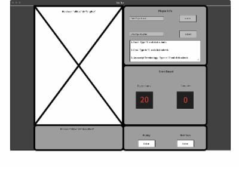

Inspiration

This is a game I enjoyed as a kid with sibling, cousins, or friends.  I wanted to keep the games classic structure while adding elements that I enjoy today.

Description

Page loads and allows player to enter name.  Player then chooses Topic.  Once both are selected, player clicks start and the game is played out.  If player wins player win counter goes up.  If player loses cpu counter goes up.  Game notifies player to click the replay button to play again.

Trello
https://trello.com/b/Gc4oahfL/project-1

GitHub Url
https://josephbkim.github.io/Unit1Project/

Technologies and Resources Used
https://stackoverflow.com/questions/4547609/how-do-you-get-a-string-to-a-character-array-in-javascript

https://sweetalert2.github.io/#download

//https://stackoverflow.com/questions/23409252/loop-from-a-to-z-in-jquery
// 

https://www.w3schools.com/howto/howto_css_dropdown.asp

https://www.w3schools.com/js/js_random.asp

https://stackoverflow.com/questions/33801650/how-do-i-refresh-a-div-content

https://stackoverflow.com/questions/881085/count-the-number-of-occurrences-of-a-character-in-a-string-in-javascript

https://www.w3schools.com/jquery/jquery_ajax_load.asp

https://jquery.com/download/

PreWork

Features in Progress

Nav drop down nav Contents
Reset Button fully fuctional
Manual Word Input
